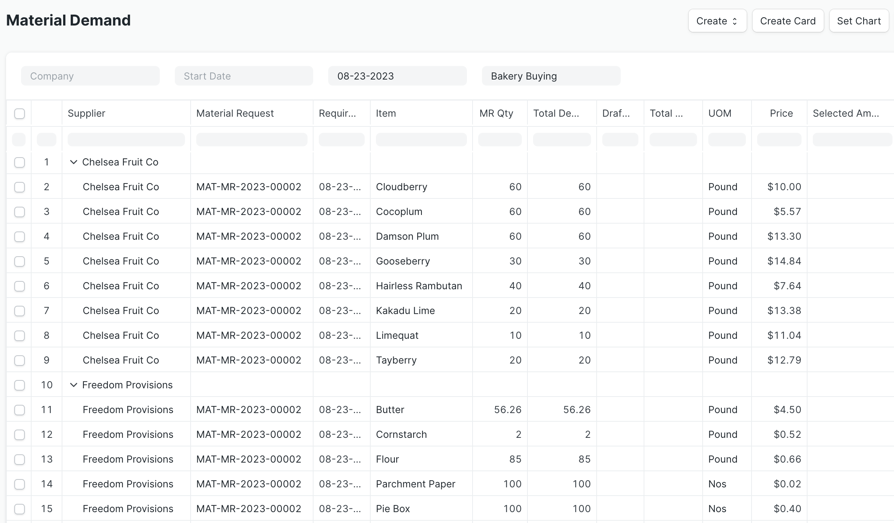
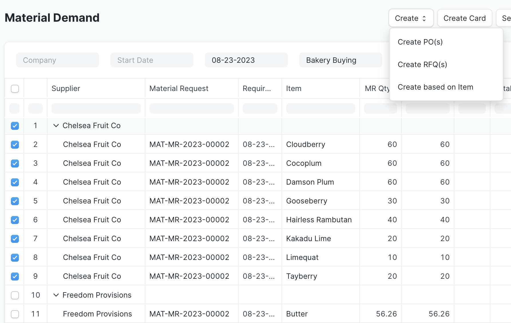

# Material Demand

Material Demand is a report-based interface that allows a user to aggregate required Items across multiple Material Requests, Suppliers, and requesting Companies, then create draft Purchase Orders in that process.

The right-hand side of the report has selection boxes to indicate which rows of Items to include to create Purchase Orders. Ticking the top-level supplier box will automatically check all the Items for that supplier. 

Once you're satisfied with your selections, clicking the Create PO(s) button will generate draft a Purchase Order for each supplier selected. If there is more than one company requesting materials from the same supplier, the PO is marked as a Multi-Company Purchase Order. All generated Purchase Orders remain in draft status to allow you to make edits as needed before submitting them.

After generating the draft Purchase Orders, the Material Demand report updates to display the quantity ordered in the Draft PO column. Note that after you submit the Purchase Orders, the Items rows no longer show in the report.

## Configuration
The Material Demand report is available on installation of the Inventory Tools application, but there are configuration options in Inventory Tools Settings to modify its behavior.

When the Material Demand report generates Purchase Orders, it fills the PO Company field with the company specified in the filter, or if that's blank, the one provided in the dialog window. To retain this default behavior, leave the Purchase Order Aggregation Company field in Inventory Tools Settings blank. However, if you populate this field, the report will use its value in the Purchase Order's Company field instead. In either case, if there's more than one company requesting materials from the same supplier, the report will select the Multi-Company Purchase Order box for that supplier's PO.

The Aggregated Purchasing Warehouse field has a similar impact on the report's behavior. By default, the field is blank and the Material Demand report applies the warehouses set per Item in the Material Request as the Item's warehouse in the new Purchase Order. If you set a value in this field, the report will instead use the specified warehouse for each Item in the Purchase Order.
